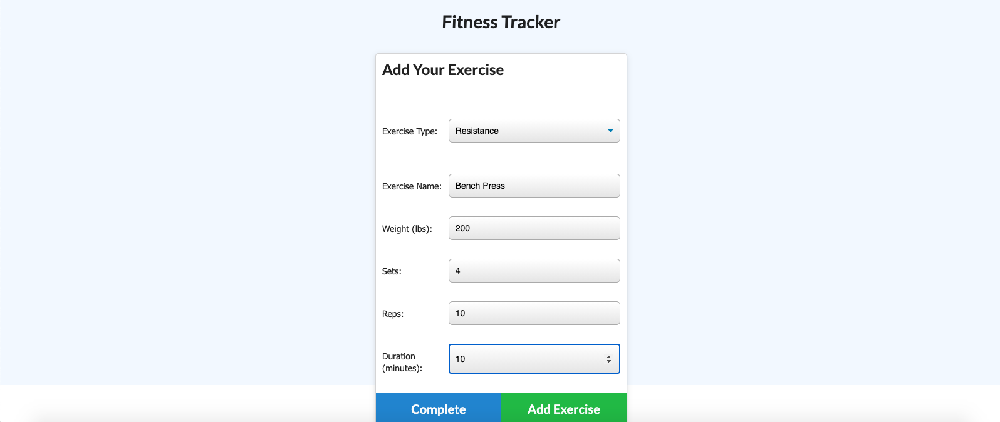

# Fitness Tracker

## Table of Contents
* [Installation](#installation)
* [Description](#discription)
* [Contribution](#contribution)
* [Contact](#contact)

## Installation

No installation required. Users will be directed to the heroku link listed below or on the repo page which brings you to a live website that will take information from the user and will allow the user to add and eat burgers.

## Description

The fitness tracker allows users to create a log of their workouts and get the previous weeks workout numbers. When a user completes an exercise, they will add the type of exercise (cardio or weight), add the relevant fields, and the workout will be logged. When the user clicks on the stats tab, graphics of the users workouts and progress are displayed.

Creating this full stack app is difficult in terms of taking other's code and applying the entire backend. It was a lot more challenging than I would have thought and it was very difficult.

## Contribution

If you think you can add functionality to this project, see a bug, or have styling suggestions, please feel free to message me through one of my contact options listed below.

# Contact

* Email: evanfurniss@gmail.com
* LinkedIn: https://www.linkedin.com/in/evan-furniss-03894b1bb/
* GitHub: https://github.com/evanfurniss

## Demo

Live app: https://fathomless-journey-82582.herokuapp.com/

